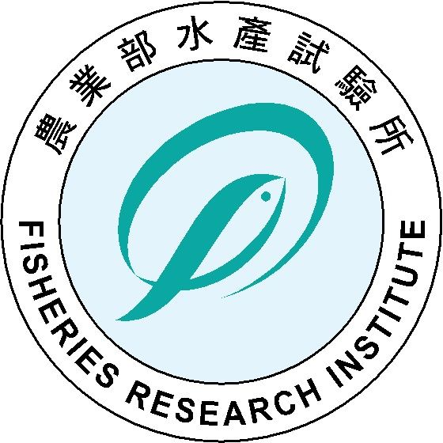

# 水試所產銷班輔導應用系統

**農業部水產試驗所 · Fisheries Research Institute**



## 系統簡介

本系統為農業部水產試驗所產銷班輔導管理平台，提供研究人員填報輔導記錄、主管審閱意見、交辦事項追蹤及統計分析等功能。

## 主要功能

| 功能模組 | 說明 |
|---------|------|
| 📊 儀表板 | 統計總覽、待辦提醒、圖表分析 |
| 📝 輔導記錄 | 填報輔導日期、出席人員、討論摘要及附件 |
| ✅ 交辦事項 | 交辦任務追蹤（唯一 ID）、進度更新 |
| 🗺️ GIS 地圖 | 全台輔導地點空間分布展示 |
| 📈 統計報表 | 多維度統計圖表、匯出 CSV |
| 👥 帳號管理 | 管理員新增/刪除/停用帳號 |

## 示範帳號

| 帳號 | 密碼 | 角色 |
|------|------|------|
| `admin` | `admin123` | 系統管理員 |
| `manager1` | `mgr123` | 管理人員（所長） |
| `柯慧玲` | `fri2024` | 研究人員 |

## 技術架構

- **前端框架**: React 18 + Vite 5
- **路由**: React Router v6
- **圖表**: Recharts
- **地圖**: Leaflet + React-Leaflet
- **資料儲存**: localStorage（前端 SPA）
- **部署**: GitHub Pages (GitHub Actions)

## 本機執行

```bash
# 安裝依賴（需 Node.js v18+）
npm install

# 開發模式
npm run dev

# 正式建置
npm run build
```

## GitHub Pages 部署

本系統透過 GitHub Actions 自動部署至 GitHub Pages。

1. 建立 GitHub 儲存庫（名稱：`fisheries-coaching-system`）
2. 推送程式碼至 `main` 分支
3. 至 Settings > Pages > Source 選擇 **GitHub Actions**
4. 推送後自動建置部署

部署後存取網址：
```
https://[YOUR_USERNAME].github.io/fisheries-coaching-system/
```

## 輔導人員名冊

本系統內建 78 位研究人員資料，涵蓋：
- 17 個縣市
- 10 個研究部門/中心
- 4 大產業別（水產養殖、海洋漁業、水產加工、其他）

---
© 2024 農業部水產試驗所 版權所有
